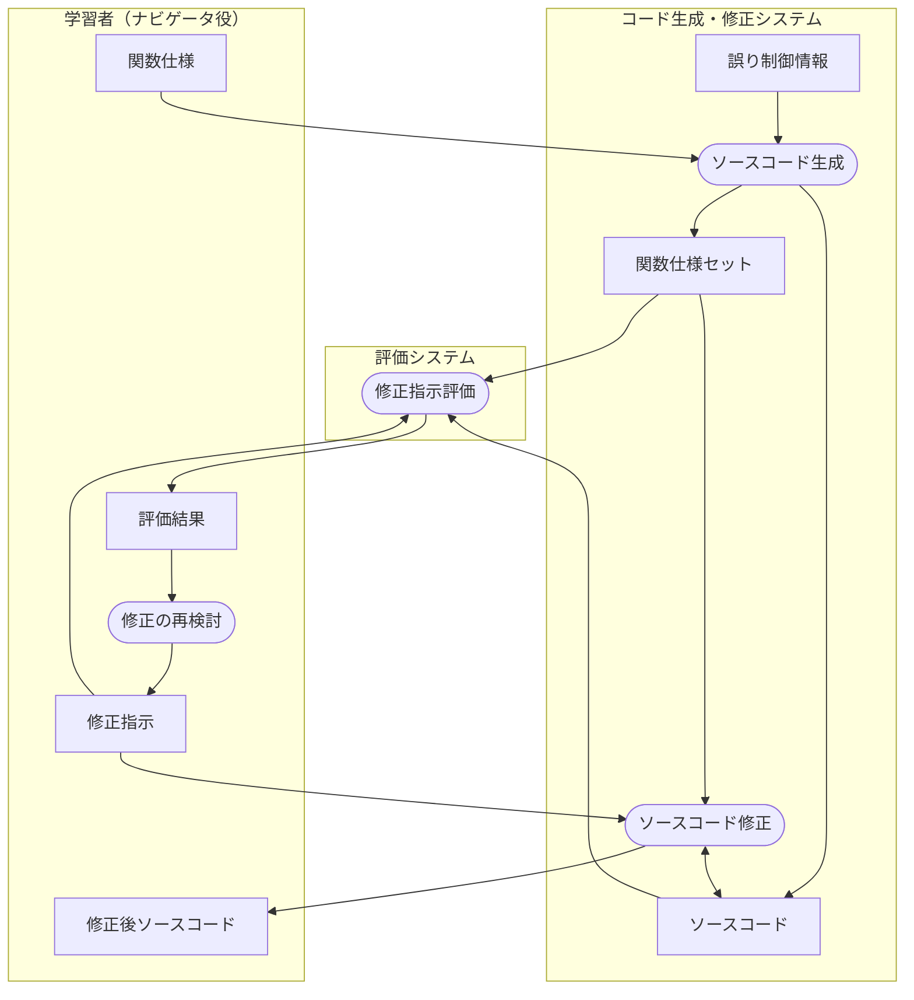

```mermaid
	flowchart TD

  

    %% 評価システム

    subgraph EvalSystem[評価システム]

        P2([修正指示評価])

    end

  

    %% ドライバ役システム

    subgraph DriverSystem[コード生成・修正システム]

        EDB[誤り制御情報]

        P1([ソースコード生成])

        Code[ソースコード]

        P3([ソースコード修正])

        FSpec[関数仕様セット]

    end

  

    %% 学習者

    subgraph User[学習者（ナビゲータ役）]

        Spec[関数仕様]

        U[修正指示]

        R[評価結果]

        ReCheck([修正の再検討])

        E[修正後ソースコード]

    end

  

    %% データフロー

    Spec --> P1

    EDB --> P1

    P1 --> Code & FSpec

    FSpec --> P3

    P3 <--> Code

    U --> P3

    Code & U & FSpec --> P2

    P3 --> E

    P2 --> R

    R --> ReCheck --> U
```
